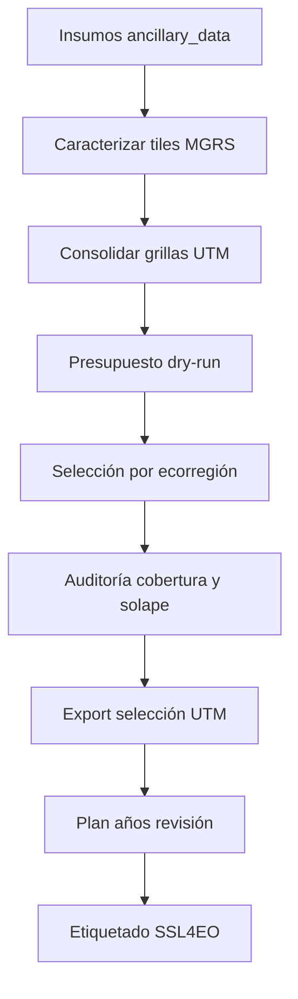

# Estrategia de caracterización y selección de rectángulos — SSL4EO v02

**Versión del pipeline:** v02 (estrategia de muestreo v05)  
**Último lanzamiento validado:** 2026-07-27  
**Corridas:** caracterización `20260727_1004` · selección `20260727_1340` · plan revisión `plan_revision_20260727_2030`

---

## 1. Propósito

Este documento describe la **estrategia operativa** del pipeline SSL4EO v02 para:

1. **Caracterizar** el territorio chileno continental en una grilla UTM de rectángulos de tamaño fijo (2×2 y 3×3 chips Sentinel).
2. **Seleccionar** un subconjunto de rectángulos que cumpla cuotas de cobertura por ecorregión, clase y tipología temporal, dentro de un presupuesto nacional de segmentos de entrenamiento.
3. **Derivar** años concretos de revisión manual (`rev_year*`) sobre la selección, sin modificar la geometría ni el split.

El objetivo final es alimentar el flujo SSL4EO con muestras espacialmente representativas, balanceadas por ecorregión, con énfasis en clases raras y dinámicas temporales, listas para etiquetado y entrenamiento self-supervised.

**Implementación:** repositorio `coverage/ssl4eo-sample-generation_v02` (cluster, rasterio; sin Google Earth Engine).

---

## 2. Principios de diseño

| Principio | Implicación |
|-----------|-------------|
| **Ecorregión como unidad de modelo** | Presupuesto, rareza, cuotas y split se resuelven por ecorregión (E01–E15). |
| **IDs nativos MapBiomas C2** | Sin remapeo a leyenda general; composición y selección usan clases del diccionario C2. |
| **UTM nativo por huso** | Huso 18 → EPSG:32718; huso 19 → EPSG:32719. No se reproyectan rasters categóricos. |
| **Dos escalas espaciales** | Composición `pct_{id}` a **30 m**; métricas temporales agregadas a **300 m**. |
| **Universo restringido al modelo general** | Solo entran clases de `CLASES_MODELO_GENERAL` (12 clases). Transversales y máscara se auditan pero no se cuotean como objetivo. |
| **Exclusividad espacial** | Un rectángulo seleccionado no puede solaparse con otro; tracker global de ocupación. |
| **Presupuesto en segmentos, no en rects** | La cuota nacional (100 000 segmentos) se traduce a número de rectángulos según tipología y tamaño. |

---

## 3. Unidades espaciales

### 3.1 Chip y rectángulo

- **Chip base:** 264 × 264 píxeles a 30 m → **7,92 km** de lado (~62,7 km²).
- **Rectángulo 2×2:** 528 × 528 px → **15,84 km** de lado (~251 km²).
- **Rectángulo 3×3:** 792 × 792 px → **23,76 km** de lado (~564 km²).

### 3.2 Grilla UTM

- Mallado regular en coordenadas UTM, anclado en origen `(100 000, 3 000 000)` por huso.
- Tiles MGRS Sentinel como unidad de procesamiento en cluster (array SLURM).
- Distorsión UTM máxima admitida: **0,5 %** (`MAX_DISTORSION_UTM`).

### 3.3 Cobertura territorial

- **15 ecorregiones** continentales (E16–E17 islas excluidas del lanzamiento nacional).
- **2 husos UTM** (18 y 19), consolidados en cuatro GeoPackages: `grilla_utm{18|19}_{2x2|3x3}.gpkg`.

---

## 4. Etapa A — Caracterización

### 4.1 Insumos

| Insumo | Uso |
|--------|-----|
| Land cover C2 anual (1999–2024) | Stack temporal por tile |
| Raster ecorregiones alineado a landcover | Dominancia ecorregional por rectángulo |
| Tiles MGRS Chile | Particionado cluster |
| Matriz `clase_x_ecorregion.csv` | Presencia y modo censo/refuerzo por par clase×eco |

### 4.2 Composición espacial (30 m)

Para cada rectángulo se calcula la **moda temporal** por píxel (26 años) y sobre ella:

```
píxeles_válidos = totales − nodata(0) − no_observado(27)
pct_{id}        = 100 × count(id) / píxeles_válidos   (id ∉ {0, 27})
valid_area_pct  = 100 × píxeles_válidos / píxeles_totales
ha_{id}         = pct_{id}/100 × area_valida_ha
```

- La **clase 0 no entra** al vector `pct_{id}` (es nodata del raster, no clase censable).
- Se registran además `transversal_pct`, `mascara_pct`, `general_pct` para auditoría.

### 4.3 Métricas temporales (300 m)

Sobre bloques agregados a 300 m (enmascarando nodata/noobs):

| Métrica | Descripción |
|---------|-------------|
| `lulc_mode_id`, `lulc_mode_pct` | Clase dominante en el periodo completo |
| `transition_pct` | Proporción de píxeles con cambio de moda entre periodos Landsat |
| `stable_mode_pct`, `max_stab_run` | Estabilidad de la moda dominante |
| `md_id_P1…P4`, `md_pct_P1…P4` | Moda por periodo (P1: 1999–2004, P2: 2005–2010, P3: 2011–2016, P4: 2017–2024) |
| `n_stb_P*`, `shannon_idx`, `conf_risk_pct` | Diversidad, riesgo de confusión, estabilidad por periodo |

Estas métricas alimentan la **tipología** de selección y la derivación de años de revisión.

### 4.4 Salida de caracterización

Por corrida (`01_caracterizacion/<TAG>/`):

- `por_tile/*.parquet` — métricas por tile MGRS (parciales).
- `consolidado/grilla_utm*.gpkg` — grilla nacional unificada por huso y tamaño.
- `auditoria_caracterizacion.csv`, `summary.json`, logs.

**Corrida actual:** `20260727_1004` — Chile completo, ~170 tiles, 4 consolidados UTM.

---

## 5. Etapa B — Presupuesto y universo local

Antes de seleccionar, un **dry-run** (`06_presupuesto_seleccion.py`) valida el universo.

### 5.1 Presupuesto nacional

- **100 000 segmentos** totales (`PRESUPUESTO_SEGMENTOS_TOTAL`).
- Reparto por ecorregión según score compuesto:
  - 40 % área de clases modelo general
  - 35 % número de clases presentes
  - 25 % número de clases raras (censo/refuerzo)
- Piso por ecorregión: **2 000 segmentos** (`MIN_SEGMENTOS_ECO`).

### 5.2 Universo local (por ecorregión)

Para cada par (ecorregión, clase) en el modelo general:

| Modo | Criterio típico |
|------|-----------------|
| **censo** | Clase rara (< 1 % del área eco) con presencia suficiente |
| **refuerzo** | Clase rara que requiere densidad adicional (p. ej. tamarugo en E01/E02/E05) |
| **estándar** | Clases frecuentes |
| **techo** | Clases dominantes con cuota acotada |

Cuotas por clase:

- **Censo:** `area_ha × 50 segmentos / 1000 ha`
- **Refuerzo:** piso de **50 segmentos** por clase
- **Estándar:** proporcional al remanente del presupuesto eco

### 5.3 Cobertura objetivo de superficie

En selección (no solo conteo de rects):

- Clases **refuerzo:** cubrir ≥ **50 %** del área de la clase en la ecorregión (`COBERTURA_OBJETIVO_RARAS`).
- Clases **censo:** cubrir ≥ **30 %** (`COBERTURA_OBJETIVO_CENSO`).
- Piso de presencia por rectángulo: **50 ha** de la clase objetivo (`PISO_PRESENCIA_HA`).

---

## 6. Etapa C — Selección de rectángulos

### 6.1 Filtros de calidad (universo candidato)

**Filtro base** (relajable si un pool se agota):

| Criterio | Umbral base |
|----------|-------------|
| `valid_area_pct` | ≥ 40 % |
| `eco_dom_pct` | ≥ 50 % |
| `noobs_pct` | ≤ 10 % |

### 6.2 Orden de pools y tamaños

Selección **exclusiva** por ecorregión, en dos fases de tamaño:

1. **Fase 3×3** (grid mixto) — mayor contexto espacial.
2. **Fase 2×2** (grid homogéneo) — mayor densidad de muestras.

Orden de pools tipológicos:

```
censo → presencia (refuerzo) → transición_homogénea → anual_simple_media
→ transición_simple_media → estable_simple_media → anual_homogénea → estable_homogénea
→ relleno_presupuesto
```

Cuotas mínimas de mix: ≥ 45 % rects 2×2, ≥ 25 % rects 3×3 (objetivo de diseño; el resultado puede desviarse según disponibilidad).

### 6.3 Tipologías

Umbrales calibrables por ecorregión (`calibrar_tipologia`):

| Tipo | Condición resumida |
|------|-------------------|
| `estable_homogenea` | Alta estabilidad, moda dominante, baja transición |
| `estable_simple_media` | Estabilidad moderada, 2–4 modas |
| `transicion_homogenea` | Transición clara entre periodos |
| `transicion_simple_media` | Transición con heterogeneidad espacial |
| `anual_homogenea` | Estabilidad anual alta en rectángulo homogéneo |
| `anual_simple_media` | Variación anual en rectángulo mixto |
| `presencia_censo` / `presencia_refuerzo` | Rectángulos donde la clase objetivo alcanza piso de ha |
| `relleno_presupuesto` | Cierre de cuota cuando pools tipológicos no alcanzan |

### 6.4 Reglas especiales

- **Tamarugo (clase 3):** bbox geográfico en desierto; refuerzo en E01, E02, E05.
- **Bloqueo cruzado desierto:** evita mezclar candidatos de ecorregiones áridas incompatibles en presencia estándar (no aplica a censo/refuerzo).
- **Clases protegidas:** tamarugo, arena/playa, salar, bosque achaparrado — seguimiento explícito en auditoría.
- **Tracker espacial:** cada rectángulo seleccionado marca su celda; prohibido solape (suma de áreas = unión).

### 6.5 Split train / validation / test

- Objetivo: **70 % / 15 % / 15 %** a nivel nacional.
- **Clustering espacial** (vecindad MGRS) para evitar fugas entre splits.
- Censo/refuerzo **no participan** del split (`CENSO_PARTICIPA_SPLIT = False`).
- Corrección nacional de fugas (`corregir_fugas_split`) entre ecorregiones vecinas.
- Techo mínimo train: **50 %** por ecorregión; margen **5 %** sobre proporciones objetivo.

> En la práctica, muchas ecorregiones quedan marcadas `split_inviable` (pocos rects tipológicos), pero el split **nacional** cumple restricciones.

### 6.6 Relleno

- Tope nacional: **15 %** de rects como relleno (`TOPE_RELLENO_PCT`).
- Orden de relleno: preferir 3×3, luego 2×2.
- Motivos de cierre de pool registrados (`motivo_cierre`: cuota_cumplida, pool_agotado, cobertura_alcanzada, etc.).

---

## 7. Etapa D — Plan de años de revisión

Módulo `plan_revision/` — **post-selección**, no altera geometría ni split.

Para cada rectángulo seleccionado deriva `rev_year1` (y opcionalmente 2–3) según `sample_type`:

| Tipo | Lógica |
|------|--------|
| Anual / estable | Años representativos del periodo dominante |
| Transición | Años antes / durante / después del cambio entre modas por periodo Landsat |
| Censo / refuerzo | Año donde la clase objetivo es más representativa; fallback si no es moda en ningún periodo |

Salida en `plan_revision_<timestamp>/`:

- `seleccion_con_rev_years_utm{18|19}.gpkg` — capas canónicas con columnas `rev_*`
- `plan_revision_expandido.csv` — tabla larga (rectángulo × año × rol)
- `reporte_plan_revision.md` — auditoría de fallbacks

---

## 8. Resultados del lanzamiento 2026-07-27

### 8.1 Caracterización `20260727_1004`

- Grilla nacional UTM consolidada (4 GPKG).
- Composición sin `pct_0`; suma de `pct_{id}` ≈ 100 % sobre píxeles válidos.
- Base para selección `20260727_1340`.

### 8.2 Selección `20260727_1340`

| Indicador | Valor |
|-----------|------:|
| Rectángulos | **341** |
| Ecorregiones | **15 / 15** |
| Mix 2×2 / 3×3 | 259 / 82 (76 % / 24 %) |
| Censo + refuerzo | 228 (49 censo + 179 refuerzo) |
| Relleno | 42 (12,3 %) |
| Celdas clase×eco vacías | **0 / 118** |
| Solapes | **0** |
| Split nacional | train 254 · val 50 · test 37 |
| Cobertura tamarugo E02 | **95,1 %** |
| Tests aceptación | **15/15** OK |

Composición por tipo de muestra:

| Tipo | N | % |
|------|--:|--:|
| presencia_refuerzo | 179 | 52,5 |
| presencia_censo | 49 | 14,4 |
| relleno_presupuesto | 42 | 12,3 |
| anual_homogenea | 35 | 10,3 |
| anual_simple_media | 15 | 4,4 |
| transicion_homogenea | 9 | 2,6 |
| transicion_simple_media | 6 | 1,8 |
| estable_homogenea | 6 | 1,8 |

### 8.3 Plan revisión `plan_revision_20260727_2030`

| Indicador | Valor |
|-----------|------:|
| Rectángulos con `rev_year1` | 341 / 341 |
| Pares (rect, año) | 384 |
| 1 / 2 / 3 años por rect | 302 / 35 / 4 |
| Transiciones fallback (revisión manual) | 14 |
| Censo/refuerzo fallback | 224 (esperado en clases minoritarias) |
| Validación automática | OK |

---

## 9. Artefactos de salida (producción)

Raíz: `/home/lserey/mapbiomas_land/prod/samples_v02/`

```
samples_v02/
├── _insumos/
│   └── clase_x_ecorregion.csv          # matriz presencia (insumo fijo)
├── 01_caracterizacion/20260727_1004/
│   ├── por_tile/*.parquet
│   ├── consolidado/grilla_utm{18|19}_{2x2|3x3}.gpkg
│   └── auditoria_caracterizacion.csv
└── 02_seleccion/20260727_1340/
    ├── seleccion_nacional_utm{18|19}.gpkg   # capas canónicas métricas
    ├── seleccion_nacional.csv
    ├── informe_seleccion.md
    ├── dashboard_seleccion.html
    ├── por_ecorregion/E**/               # pools, auditoría por eco
    └── plan_revision_20260727_2030/
        ├── seleccion_con_rev_years_utm*.gpkg
        ├── plan_revision_expandido.csv
        └── reporte_plan_revision.md
```

**Regla de geometría:** medir lados y áreas solo en GPKG UTM nativo. Capas `*_inspeccion_*` en WGS84 son solo visualización.

---

## 10. Flujo operativo (resumen)



| Paso | Script / job |
|------|----------------|
| Verificar insumos | `01_verificar_insumos.py` |
| Alinear ecorregiones | `02_alinear_ecorregiones.py` |
| Lista tiles + corrida | `03_generar_lista_tiles.py` |
| Caracterizar | `04_caracterizar_tile.py` + SLURM array |
| Consolidar | `05_consolidar_grillas.py` |
| Presupuesto | `06_presupuesto_seleccion.py` |
| Seleccionar | `07_seleccionar_rectangulos.py` + SLURM |
| Visualizar | `08_visualizar_seleccion.py` |
| Informe selección | `09_generar_informe_seleccion.py` |
| Plan revisión | `10_generar_plan_revision.py` |

---

## 11. Limitaciones y pendientes conocidos

1. **`split_inviable` en 13 ecorregiones** — pocas muestras tipológicas por eco; split nacional sí cumple.
2. **14 transiciones** sin cambio de moda entre periodos Landsat → revisión manual del año asignado.
3. **224 censo/refuerzo con fallback** — clase objetivo no es moda en ningún periodo; año representativo asignado igualmente.
4. **Déficits de cuota** en algunos pares clase×eco (p. ej. refuerzo pastizal E11) — registrados en `deficit_celdas.csv`; cobertura de superficie objetivo sí se cumple vía otros rects.
5. **Presupuesto no asignado** — 8 ecorregiones con remanente por tope de relleno o disponibilidad tipológica limitada.
6. **Baseline histórica eliminada de producción** — comparaciones futuras requieren backup externo de corridas anteriores.

---

## 12. Referencias

| Recurso | Ubicación |
|---------|-----------|
| Pipeline v02 | `/home/lserey/repositorio/coverage/ssl4eo-sample-generation_v02/` |
| Lanzamiento 2026-07-27 | `docs/LANZAMIENTO_20260727.md` |
| Informe selección | `prod/.../02_seleccion/20260727_1340/informe_seleccion.md` |
| Reporte plan revisión | `prod/.../plan_revision_20260727_2030/reporte_plan_revision.md` |
| Parámetros caracterización | `config/params_caracterizacion.py` |
| Parámetros selección | `config/params_seleccion.py` |
| Diccionarios clases/eco | `config/diccionarios.py` |
| Tests aceptación | `tests/test_aceptacion_nacional.py`, `tests/test_plan_revision.py` |

---

*Documento generado el 2026-07-27. Refleja el estado del pipeline y del lanzamiento nacional UTM validado.*
